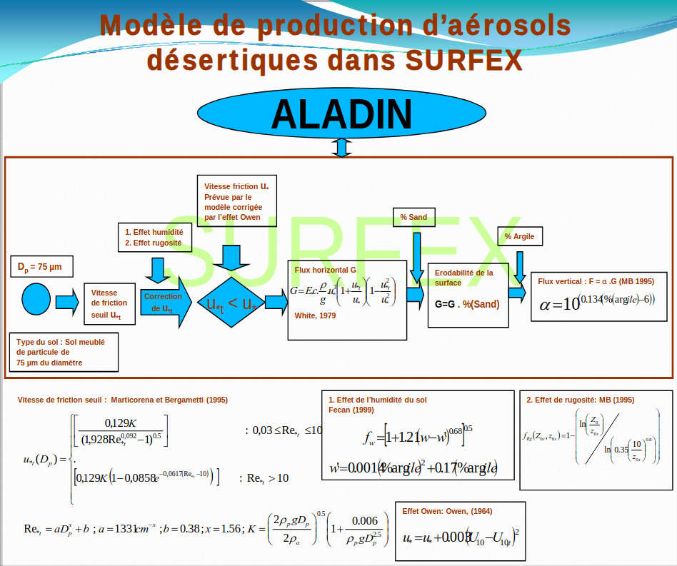

# Forecast Model 

## ALADIN Dust

The emissions of desert dust are managed in SURFEX through the DEAD (Dust Entrainment and Deposition) module developed by Zender et al. (2003) and implemented in SURFEX by Grini et al. (2005). This module was improved by Mokhtari et al. (2011). Both versions of this module (original and modified) have been integrated into version 7 of SURFEX.
The sequence of physical processes related to desert aerosols is as follows: calculation of the optical properties of desert aerosols, calculation of dry deposition, calculation of turbulent fluxes (vertical diffusion), and calculation of wet deposition.

