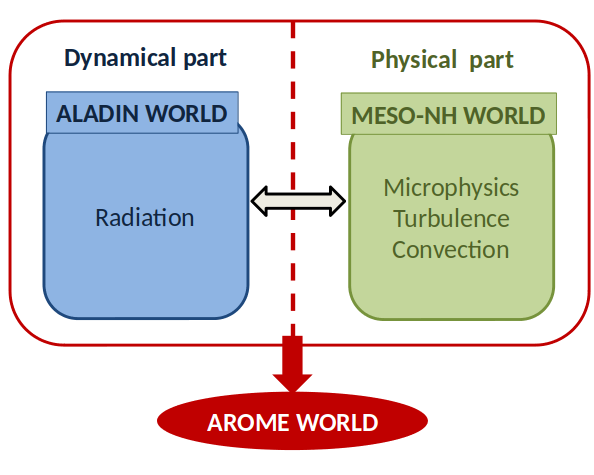

# Forecast Model 

## AROME

The convective-scale model AROME (Seity et al., 2011) has been operational at ONM (Algeria) since April 2014, covering the northern part of the country (Latitude: 28°N - 40°N, Longitude: 3°W – 9°E).
AROME takes most of the ALADIN code concerning the adiabatic part of the code (in particular the non-hydrostatic code), the main difference with the current version of ALADIN being the physics package. AROME uses a new physics package well adapted for small mesh-sizes around 2 km, this new physics package is mainly an adaptation of the one which is currently used in the research non-hydrostatic model MESO-NH (used by the team CNRM/GMME for research applications).

