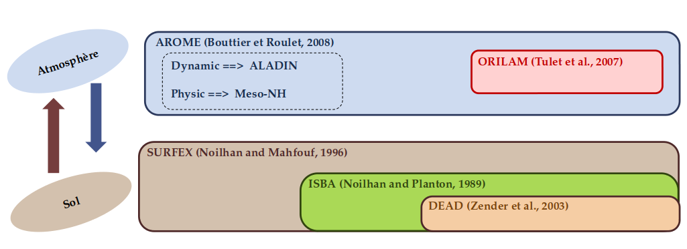

# Forecast Model 

## AROME Dust

The model can be configured to use near-real-time aerosols from CAMS. This is done by setting `USEAERO=camsnrt` , which leads to retrieval of boundary files containing aerosol mass mixing ratio fields from CAMS. Other values of `USEAERO` are related to use and generation of climatological (2D) aerosol.

