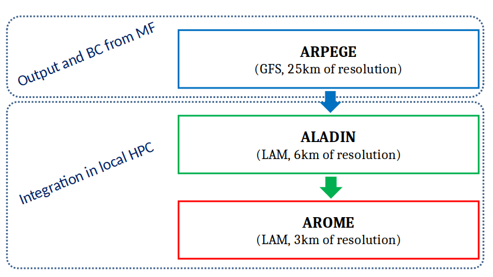

# Forecast Model 

## ARPEGE

ARPEGE (Action de Recherche Petite Echelle Grande Echelle). This model is used both at METEO-FRANCE and ECMWF; at ECMWF it is named IFS (Integrated Forecasting system). ARPEGE is a global spectral model, with a Gaussian grid for the grid-point calculations.
ARPEGE/IFS can work with different physics packages; there is one physics package used at METEO-FRANCE and one other at ECMWF. ARPEGE can be used for climate applications and in this case it uses a slightly different physics package. It is planned to harmonize the physical packages as far as possible between the operational version of ARPEGE (used for routine forecasts) and the climate version of ARPEGE.

