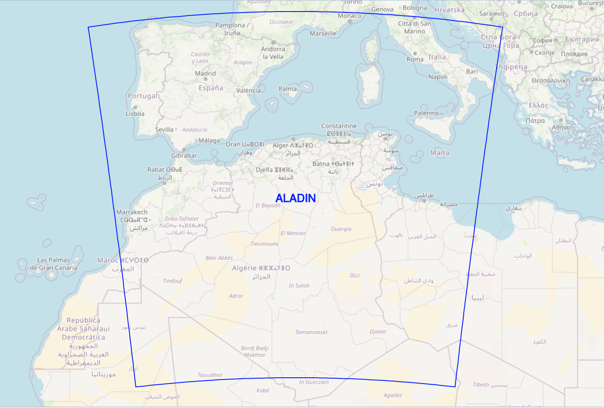

# ALADIN Operational Configuration

| Cycle                                | Cy43                                                                 |
|----------------------------------------|-----------------------------------------------------------------------------|
| Latitude      | 18.5 - 46.5 N                          |
| Longitude          | 11W - 17E                    |
| Horizontal Resolution        | 18 Km         |
| Grid Points          | 350 * 350 |
| Vertical Resolution          | 70 Levels |
| Grid Points          | 72 Hours |
| Coupling Range          | 1 hour |

