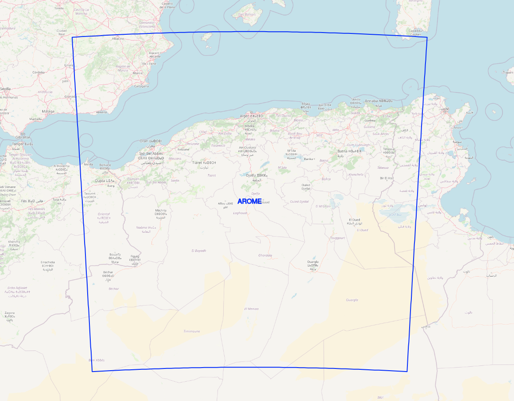

# AROME Operational Configuration

| Cycle                                | Cy43                                                                 |
|----------------------------------------|-----------------------------------------------------------------------------|
| Latitude      | 28 - 40 N                          |
| Longitude          | 3W - 9E                    |
| Horizontal Resolution        | 3 Km         |
| Grid Points          | 400 * 400 |
| Vertical Resolution          | 60 Levels |
| Grid Points          | 48 Hours |
| Coupling Range          | 1 hour |

