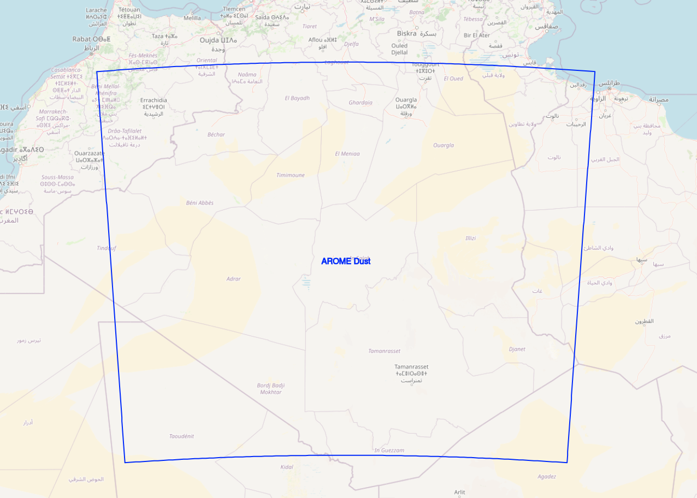

# AROME Dust Research & Developement Configuration

| Cycle                                | Cy46                                                                 |
|----------------------------------------|-----------------------------------------------------------------------------|
| Latitude      | 22 - 33 N                          |
| Longitude          | 4.5W - 11E                    |
| Horizontal Resolution        | 2.5 Km         |
| Grid Points          | 621 * 521 |
| Vertical Resolution          | 41 Levels |
| Grid Points          | 48 Hours |
| Coupling Range          | 1 hour |

