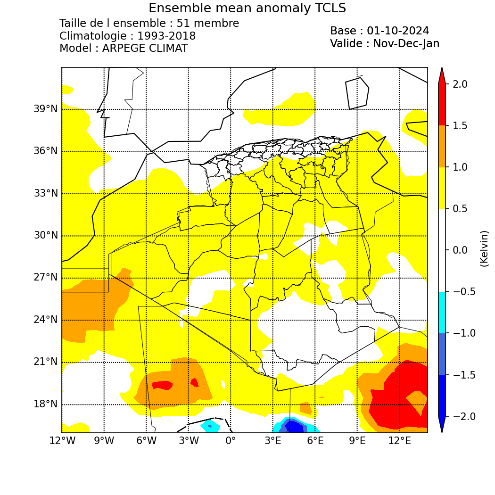

# Seasonal Forecast 

--------------------------------------
### Introduction
The ARPEGE model is a global spectral general circulation model developed by Météo-France in collaboration with the ECMWF for numerical weather prediction. Its climate version, ARPEGE-Climat, was introduced in the 1990s (Déqué et al., 1994). Over time, it has become the atmospheric component of the CNRM's Earth system model, integrating the atmosphere, ocean, vegetation, and sea ice (Salas y Melia et al., 2005). ARPEGE's grid can be adjusted to shift the pole position and zoom into regions of interest, enabling regional climate studies (Déqué and Piedelievre, 1995; Gibelin and Déqué, 2003). For instance, the "Medias" version of ARPEGE-Climat v4 focuses on the Europe-Mediterranean-North Africa region, with a pole in the Tyrrhenian Sea, a stretching factor of 2.5, and a resolution of about 50 km.

----------
### Operational Machines Used:

1. **passerellemf (IP: passerellemf.meteo.dz)**: This serves as a gateway between users (machines) of the PNT and the systems of Météo-France.
2. **Belenos**: A supercomputer at Météo-France where outputs from the Arpège-Climat model are stored.
3. **fennec (ONM's supercomputer) (IP: login2.fennec.meteo.dz)**: This machine runs models such as ALADIN, AROME, ALADIN DUST, ALADIN CLIMAT, and ARPEGE CLIMAT, along with programs that prepare products for clients.
4. **Local machine**: A virtual machine created for analysis, processing, and visualization of Arpège-Climat outputs. It is equipped with numerous Python packages useful for mathematics, statistics, and data science.

----------
### ARPEGE CLIMAT Numerical Forecast Chain

**Step 1: Preparation of Files on Belenos**

To connect to the Météo-France supercomputer, Belenos, we use the `passerellemf` machine, which is the only gateway authorized by Météo-France for server access.

**Scripts to Execute on passerellemf to Access Belenos:**
```bash
 ${HOME}/Belenos
```
**File Information:**

Currently, we utilize five meteorological parameters for the seasonal forecast bulletin. To prepare the required outputs for this bulletin, we need to retrieve the first member of the Hindcast (1993-2016), which serves as a climatological reference for calculating anomalies, along with the 50 members of the Forecast to assess probabilities.

**Example of File Names to Retrieve for the Base Month of September 2020:** 

|Hindcast (First member of 1993)|Forecast (the 51 member)|Parameters|
|---|---|---|
| H1993I001_arpsfx_6hourly_tas_1993-1994.nc  | F2020I051_arpsfx_6hourly_tas_2020-2021.nc | Average temperature |
| H1993I001_arpsfx_6hourly_tasmax_1993-1994.nc  | F2020I051_arpsfx_6hourly_tasmax_2020-2021.nc | Maximum temperature |
| H1993I001_arpsfx_6hourly_tasmin_1993-1994.nc  | F2020I051_arpsfx_6hourly_tasmin_2020-2021.nc | Minimum temperature |
| H1993I001_arpsfx_6hourly_lwepr_1993-1994.nc  | F2020I051_arpsfx_6hourly_lwepr_2020-2021.nc | Precipitation |
| H1993I001_arpsfx_6hourly_psl_1993-1994.nc  | F2020I051_arpsfx_6hourly_psl_2020-2021.nc | Sea level pressure |

File description :

| H1993I001_arpsfx_6hourly_tas_1993-1994.nc | F2020I051_arpsfx_daily_lwepr_2020-2021.nc|
| ---   |         ---           |
| **H**: Hindcast, 1993: First year of the hindcast, **I**: Base month September (09), **001**: First member, **Arpsfx**: ARPEGE-SURFEX, **6hourly**: One value every 6 hours (4 per day), **tas**: Average temperature, **1993-1994**: 7 months from September 1993 to March 1994, **.nc**: NetCDF file format. | **F**: Forecast, **2020**: Year of the forecast, **I**: Base month September (09), **051**: 51 member, **Arpsfx**: ARPEGE-SURFEX, **daily**: One value per day (1 per day), **lwepr**: Cumulative precipitation, **2020-2021**: 7 months from September 2020 to March 2021, **.nc**: NetCDF file format.|

-----

The scripts for preparing the hindcast and forecast files on the Belenos machine, which are located in Mr. Mokhtari's account, are `Get_Data_Hindcast.sh` and `Get_Data_Forecast.sh`, respectively. 

These two scripts can be found at the following paths:
```bash
- `$HOME/STAGE2018/ALADIN_CLIMAT/GetData/ARPEGE_CLIMAT/Get_Data_Hindcast.sh`
- `$HOME/STAGE2018/ALADIN_CLIMAT/GetData/ARPEGE_CLIMAT/Get_Data_Forecast.sh`
```
-----
**Downloading Files from Météo France:**

The download of these prepared files from Belenos is done on the passerellemf machine. The script that facilitates this task is `Get_Data_ARPEGE.sh`.

```bash
► $HOME/Get_Data_ARPEGE.sh
```
-----
**Processing Files and Calculating Anomalies and Probabilities:**
The processing of ARPEGE-Climat files and the calculation of anomalies are performed on our supercomputer (Fennec machine). The scripts that facilitate this task are: `Ghreadnc.sh`, `Ghreadnc_tas.sh`, `Ghreadnc_psl.sh`, `Gfreadnc.sh`, `Gfreadnc_tas.sh`, `Gfreadnc_mslp.sh`, `compile`, `anomaly.exe`, `anomaly_mslp.exe` and `anomaly_tas.exe`.

### **Processing Hindcast and Forecast Files:**

**For the hindcast:**
```bash
- `$HOME/ALADIN_CLIMAT/ARPEGE/Ghreadnc.sh`
- `$HOME/ALADIN_CLIMAT/ARPEGE/Ghreadnc_tas.sh`
- `$HOME/ALADIN_CLIMAT/ARPEGE/Ghreadnc_psl.sh`
```
The outputs for minimum and maximum temperatures and precipitation are at a daily frequency and are processed by the `Ghreadnc.sh` script. In contrast, the temperatures at two meters are at a frequency of 6 hours and are processed by the `Ghreadnc_tas.sh` script.

**For the Forecast:**
```bash
- `$HOME/ALADIN_CLIMAT/ARPEGE/Gfreadnc.sh`
- `$HOME/ALADIN_CLIMAT/ARPEGE/Gfreadnc_tas.sh`
- `$HOME/ALADIN_CLIMAT/ARPEGE/Gfreadnc_mslp.sh`
```
**Calculating Anomalies and Probabilities:**
```bash
- `$HOME/ALADIN_CLIMAT/ARPEGE/tools/compile`
- `$HOME/ALADIN_CLIMAT/ARPEGE/tools/anomaly.exe`
- `$HOME/ALADIN_CLIMAT/ARPEGE/tools/anomaly_tas.exe`
- `$HOME/ALADIN_CLIMAT/ARPEGE/tools/anomaly_mslp.exe`
```

**Plotting Maps with Python:**

The map plotting is done using python3 . The script used for this task is:

```bash
► Carte_Oper.sh → $HOME/ARPEGE_CLIMAT
```

After executing this script, the output files in PNG format are generated and stored in a folder named as follows:  
**Carte_ARPEGE_CLIMAT_BM09_2020** (where **BM09_2020** refers to the base month of September 2020).  
These files can be found at the following path:  
```bash
$HOME/ARPEGE_CLIMAT/cartes
```
**Plot example**




For more detailed informations contact [Walid Chikhi](https://github.com/walidchikhi) to give you the manuel of the seasonal forecast.