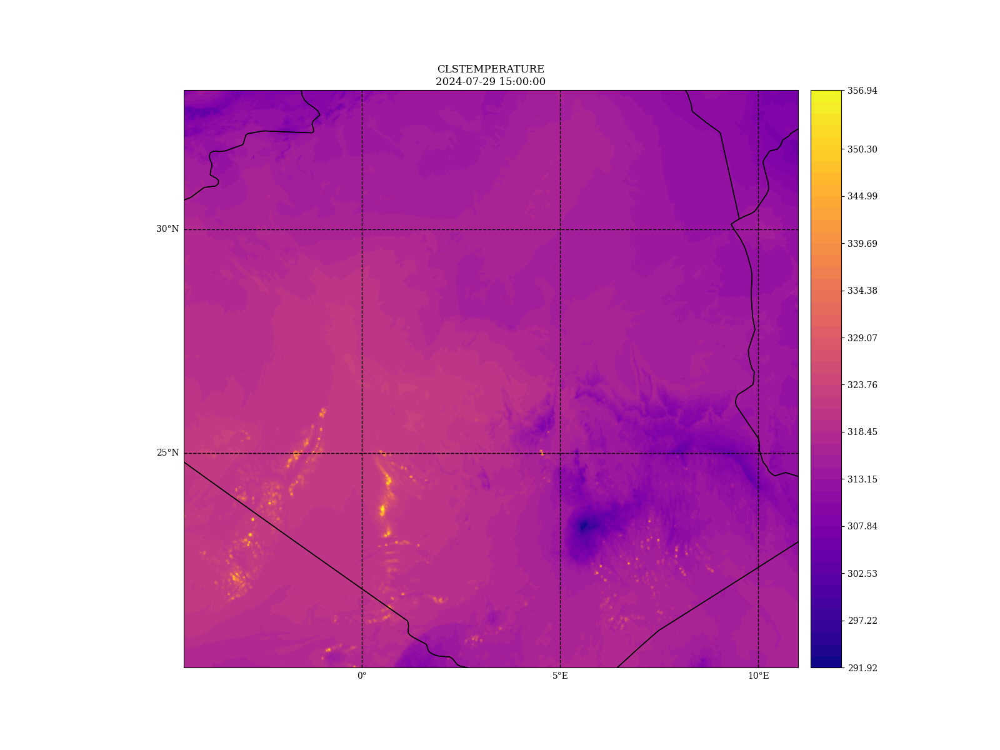

# EPyGrAM

## General

 * [EPyGram wiki](https://opensource.umr-cnrm.fr/projects/epygram/wiki/)
 * [EPyGram doc](https://umr-cnrm.github.io/EPyGrAM-doc/)

## Using EPyGrAM (version 1.5.2)

* Easy as pie:
```bash
  pip install epygram
```
* Test:
    to plot any parameter using epygram use the following command : epy_cartoplot.py -f [ParamName] [FileName]
    Follow the example :
```bash
  epy_cartoplot.py -f CLSTEMPERATURE PFAL03ALGE01+0015
```
You should get something like this :


Enjoy!