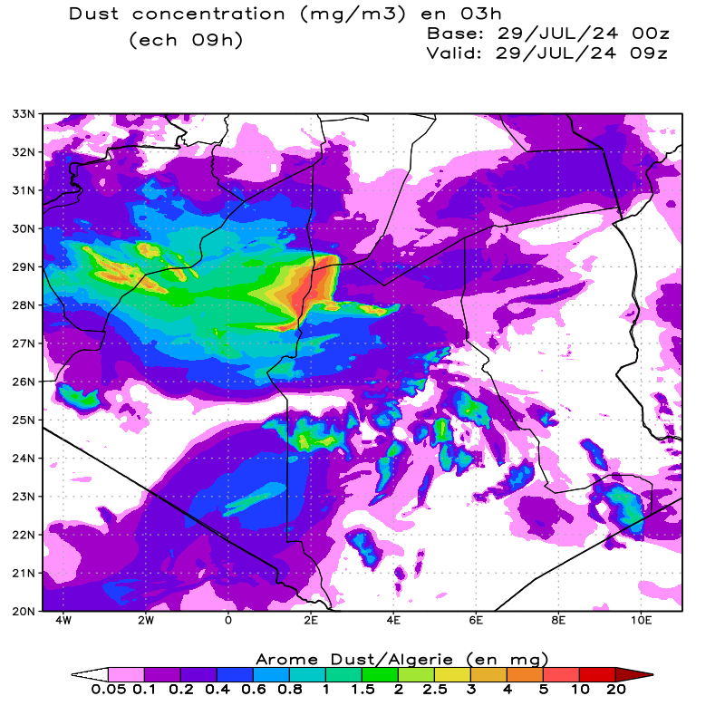

# GrADS

The Grid Analysis and Display System (GrADS) is an interactive desktop tool that is used for easy access, manipulation, and visualization of earth science data. GrADS has two data models for handling gridded and station data. GrADS supports many data file formats, including binary (stream or sequential), GRIB (version 1 and 2), NetCDF, HDF (version 4 and 5), and BUFR (for station data).

To generate plots with GrADS you need to convert your FA files into a binary file (*.dat) using Fortran, then you need to creat a *.ctl file which will describe the data inside the converted file.

Here's an example of a (ctl) file :
```bashr
DSET dust_surf.dat
UNDEF  -9999
TITLE AROME_DUST model
xdef 621 linear -4.5 0.025
ydef 521 linear  20.0 0.025
ZDEF   1 LEVELS  1000
TDEF 9 LINEAR 00Z29Jul2024 03hr 
VARS 8
aod   0 99  aerosol optical depth
flx   0 99  dust flux
u10   0 99  u-wind
v10   0 99  v-wind  
zmsurf   0 99  dust concentration
t2m   0 99  temperature 2 metres
ssr   0 99  surface solar radiation
mslp   0 99 MSL Pressure 
ENDVARS
```
Now we can plot any parameter in this file.
If you already have a grads script just run :
```bash
    grads -blc yourscript.gs
```
if you don't have a script just run the following commands :
```bash
grads
open yourctlfile.ctl
set t [time]
set grads off
set poli on
set grid on
set gxout shaded
set mpdset hires
set map 1 1 6
colndx='your level index
colevs='your color levels
set clevs 'colndx'
set ccols 'colevs'
d zmsurf*1e-3
draw shp alg.shp
run cbarn.gs
set strsiz .17
set string 1 l 6
draw string 0.8 10.8 '  ' Dust concentration (mg/m3) en 03h '
set strsiz .17
set string 1 l 6
draw string 1.5 10.4 ' '(ech ' chh 'h)'
set strsiz .16
set string 1 l 6
draw string 5.0 10.5 ' 'Base: ' ana
set strsiz .16
set string 1 l 6
draw string 5.0 10.2 ' 'Valid: ' fct
set strsiz .15
set string 1 l 6
draw string 3.0 1.0 ' 'Arome Dust/Algerie (en mg)'
set display color white
gxprint con_'it0'.png png x800 y800 white
```
the results will be something like this :

